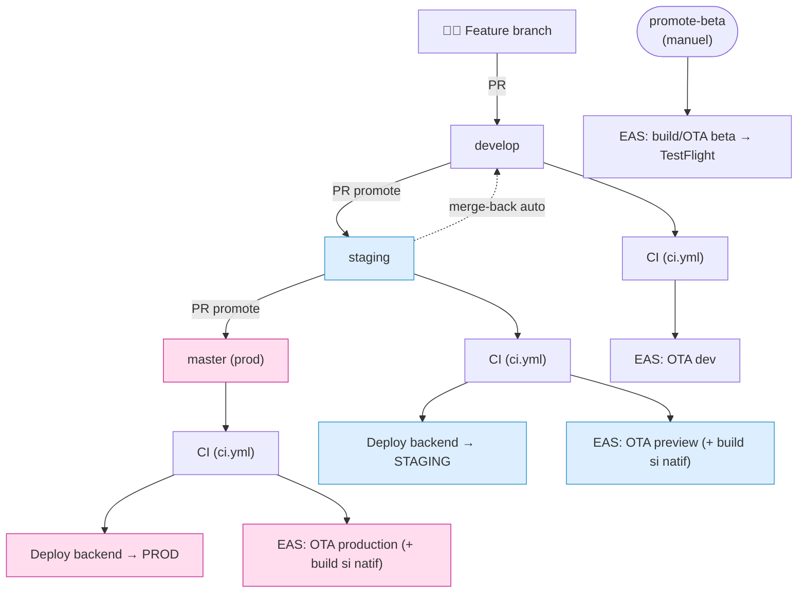
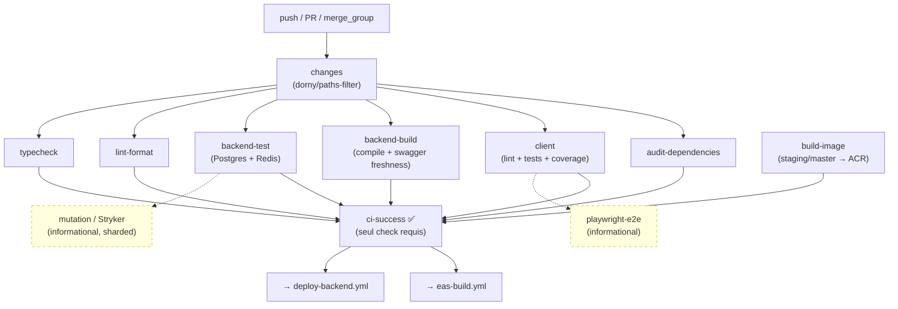
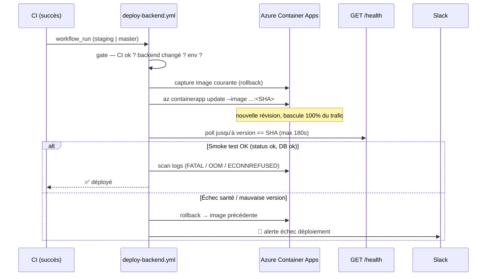
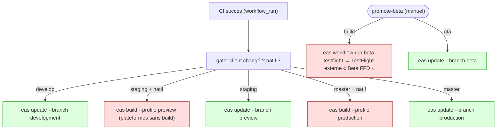
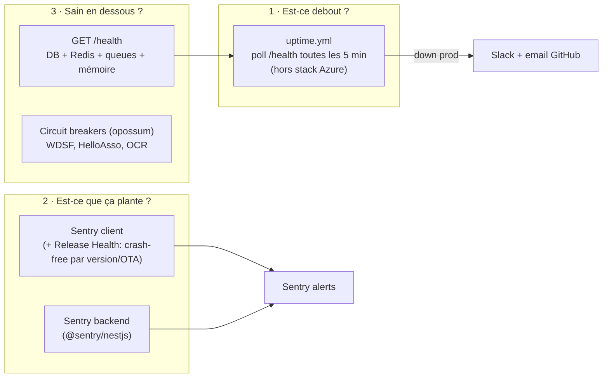

# CI/CD — Guide complet FFD-Connect

Documentation de référence du pipeline CI/CD : intégration continue, déploiement
backend (Azure Container Apps), déploiement mobile (EAS), release, et monitoring.

> **Quick reference** : pour la table des jobs bloquants / la liste des échecs CI
> courants, voir [`ci-cd-minimal.md`](./ci-cd-minimal.md).
> **Décisions** : voir [ADR-0016 (stratégie CI par tiers)](../adr/0016-ci-tiered-execution-strategy.md)
> et [ADR-0011 (monitoring)](../adr/0011-monitoring-newrelic-sentry.md).

Les schémas ci-dessous sont en [Mermaid](https://mermaid.js.org/) — rendus
automatiquement par GitHub et Starlight.

---

## 1. Vue d'ensemble — du commit à la prod

Le flux Git est **feature → develop → staging → master**, et chaque branche
déclenche une combinaison différente de CI, déploiement backend et build mobile.



**Règle d'or** : rien ne se déploie sans que la **CI passe** d'abord. Les workflows
de déploiement (`deploy-backend.yml`, `eas-build.yml`) se déclenchent sur
`workflow_run` **après succès de la CI**, jamais directement sur push.

| Branche          | CI                          | Backend                       | Mobile                                                    |
| ---------------- | --------------------------- | ----------------------------- | --------------------------------------------------------- |
| `feature/*` (PR) | ✅ complète (path-filtered) | —                             | —                                                         |
| `develop`        | ✅                          | —                             | OTA canal `development`                                   |
| `staging`        | ✅                          | 🚀 Container Apps **staging** | OTA canal `preview` (+ build natif si empreinte nouvelle) |
| `master`         | ✅                          | 🚀 Container Apps **prod**    | OTA canal `production` (+ build si natif)                 |
| `beta` (manuel)  | —                           | —                             | build/OTA canal `beta` → TestFlight                       |

---

## 2. Intégration continue — `ci.yml`

Une seule pipeline, exécutée en **tiers** selon l'événement et la branche (voir
ADR-0016). L'objectif : feedback rapide sur les PR, filet de sécurité complet sur
les branches protégées, sans revalider 3× le même code.



### Tiers d'exécution

| Tier              | Jobs                                                                           | Quand                                             |
| ----------------- | ------------------------------------------------------------------------------ | ------------------------------------------------- |
| **1 — Core**      | `backend-test`, `backend-build`, `client`                                      | Toujours (PR : si les chemins concernés changent) |
| **2 — PR gate**   | `playwright-e2e`, `mutation`, `audit-dependencies`, `typecheck`, `lint-format` | Sur PR (+ push master/hotfix pour audit)          |
| **3 — Prod gate** | `audit-dependencies`, build checks                                             | Aussi sur push `master` / `hotfix/**`             |

### Bloquant vs informationnel

- **Bloquant** : `typecheck`, `lint-format`, `backend-test`, `backend-build`,
  `client`, `audit-dependencies` et `build-image` (staging/master, seulement si
  la promotion touche le backend).
- **Landing** : plus d'image Docker. `ffd.gabin-simond.fr` est servi par GitHub
  Pages (`deploy-landing.yml`, sur push `staging`). La PR est protégée par
  l'étape `Build landing` (`pnpm --filter landing build`) du job `lint-format`,
  lancée quand la landing ou `docs/legal/**` changent.
- **Informationnel** (n'empêche pas le merge) : `playwright-e2e`, `mutation`.
  La couverture mutation complète est fournie par `mutation-nightly.yml`.

### Le job `ci-success`

C'est l'**agrégateur** : il lit le résultat de tous les jobs, traite `skipped`
(path-filtering) comme un succès, et échoue si un job bloquant est `failure`/`cancelled`.

> ⚠️ **Protection de branche** : le **seul** check requis est `CI Success`.
> Ne jamais lister les jobs individuels (surtout les shards `Mutation (…)`) comme
> requis — ils apparaissent/disparaissent selon le path-filtering.

### Optimisations clés

- **Cache pnpm** (`cache: 'pnpm'` + `--frozen-lockfile --prefer-offline`).
- **Cache Docker registry** sur ACR (`cache-to: type=registry,mode=max`).
- **Path-filter** (`dorny/paths-filter`) : skip backend si seul le client change,
  et inversement. Les packages partagés (`packages/**`, `pnpm-lock.yaml`) déclenchent tout.
- **Stryker** sharded + `--since` + incrémental.
- **Actions pinnées par SHA** (défense supply-chain contre le déplacement de tag).

**Durée réelle** : ~3,4 min sur un run typique.

---

## 3. Déploiement backend — `deploy-backend.yml`

Cible : **Azure Container Apps** en mode _single-revision_ (la VM est retirée).
Authentification **OIDC** (aucun secret Azure statique à faire tourner).



**Points importants**

- `az containerapp update --image <ACR>/…:<sha>` crée une nouvelle révision et
  bascule 100 % du trafic. L'image est **taggée par SHA** (immuable, reproductible).
- **Smoke test** : on attend que la nouvelle révision réponde avec
  `version == SHA déployé` (une vieille révision répond encore `200` pendant la
  bascule → on ne se contente pas d'un `200`, on vérifie la version). Cold start
  Container Apps : jusqu'à 180 s.
- **Rollback auto** sur échec : re-`update` vers l'image précédente.
  ⚠️ **Toutes les migrations doivent être rétrocompatibles** — un rollback
  d'image laisse le schéma DB déjà migré en avance.
- **Déploiement seulement si le backend change** : le job `changes` de `ci.yml`
  (sortie `backend_image`) calcule, sur un push `staging`/`master`, le diff
  entre le **SHA réellement déployé** sur l'environnement et `HEAD`, restreint à
  ce que copie le Dockerfile backend (`apps/backend/`, `packages/shared/`,
  `packages/jest-config/`, `patches/`, `scripts/`, manifestes `package.json`,
  `pnpm-lock.yaml`, `pnpm-workspace.yaml`, `.npmrc`, `.dockerignore`) et
  `deploy-backend.yml`.
  Le SHA déployé est lu via l'API Actions (gratuit, ne réveille pas l'app :
  **jamais** `/health`) : dernier run de `deploy-backend.yml` dont le job
  `Deploy to Staging` / `Deploy to Production` a conclu `success`. Un
  déploiement annulé par rollback échoue ce job et ne compte donc pas. Le SHA
  est pris dans le **titre du run** (`run-name: Deploy Backend · <branche> @
<sha>`) : un run `workflow_run` porte le `head_sha` de develop, et les
  deployments GitHub créés par `environment:` aussi — ni l'un ni l'autre ne
  donne le commit déployé. Ne pas modifier ce `run-name` sans adapter `ci.yml`.
  SHA introuvable (premier passage après la mise en place), fetch ou diff en
  échec → on construit (fail-safe).
  `build-image` (« Build & Push Backend Image ») ne construit l'image `<sha>`
  que dans ce cas, et le `gate` de `deploy-backend.yml` déploie **ssi ce job a
  réussi** dans le run CI déclencheur (lu via l'API Actions). Une seule décision,
  donc jamais de déploiement vers un tag inexistant. Chaque promotion sans
  changement backend évite un build d'image, un réveil à froid de l'app et une
  révision.
  Comme la base est le SHA déployé, une promotion annulée (`cancel-in-progress`
  de la CI), une CI en échec non relancée ou un rollback ne font **pas** perdre
  de changement backend : la promotion suivante le voit encore dans son diff.
- Conséquences à connaître :
  - Après une promotion sans changement backend, la `version` de `/health` est
    le SHA du **dernier déploiement**, pas la pointe de `staging`. C'est normal.
  - Les correctifs de l'image de base (`node:22-alpine`) n'arrivent plus qu'avec
    un changement backend. Pas de reconstruction hebdomadaire automatique (elle
    imposerait un déploiement, donc un réveil) : pour forcer une mise à jour,
    promouvoir un changement qui touche un chemin backend (une montée de
    dépendance suffit). Relancer la CI seule ne reconstruit rien (diff vide).
    Trivy (report-only) signale les CVE à chaque build.
- `concurrency: cancel-in-progress: false` — un déploiement en cours n'est **jamais**
  annulé, les suivants sont mis en file.
- La prod est protégée par l'**Environment GitHub `production`** (approbation
  manuelle possible selon la config des reviewers).

Infra : `infra/terraform/`.

---

## 4. Déploiement mobile — `eas-build.yml`

Deux modes : **OTA** (`eas update`, gratuit, instantané, JS/asset only) et **build
natif** (`eas build`, ~2 $, requis si le code natif/config/runtime change).



### Canaux / environnements

| Branche         | Canal EAS     | Environnement EAS | Distribution         |
| --------------- | ------------- | ----------------- | -------------------- |
| `develop`       | `development` | development       | interne (dev client) |
| `staging`       | `preview`     | preview           | interne              |
| `beta` (manuel) | `beta`        | beta              | **TestFlight**       |
| `master`        | `production`  | production        | stores               |

> **Injection d'env** : `eas update --environment <env>` lit les variables
> `EXPO_PUBLIC_*` depuis l'**environnement EAS** (dashboard), **pas** depuis
> `eas.json` (qui ne vaut que pour `eas build`). Toujours corriger les deux.
> `runtimeVersion` : **`policy: "fingerprint"`**, une empreinte du code natif
> calculée par Expo (plus de numéro à bumper). Une OTA n'atteint que les builds
> de même empreinte ; les numéros de version en sont exclus
> (`apps/client/fingerprint.config.js`). L'empreinte dépend de la variante
> (`EXPO_PUBLIC_APP_ENV`) : chaque `eas update` de la CI est suivi de
> `scripts/check-ota-reach.sh`, qui vérifie qu'au moins un build du canal peut
> la recevoir (bloquant pour l'OTA beta, contrôlé aussi avant publication ;
> avertissement pour preview et production ; rien sur development, dont les dev
> clients n'ont pas de canal).
>
> **Bascule (oct. 2026)** : les binaires installés avant le passage à
> `fingerprint` portent la runtime `2.5.0` et ne reçoivent plus aucune OTA. Il
> faut un build natif par canal : preview (automatique à la promotion
> develop → staging, `app.config.js` ayant changé), beta (`promote-beta`,
> `action: build` — l'action `ota` échoue tant que ce build n'existe pas), et
> dev clients à reconstruire à la main.
> L'OTA beta n'utilise pas `--environment preview` (qui imposerait
> `EXPO_PUBLIC_APP_ENV=preview`) : elle reprend ses variables via `eas env:pull`.
>
> Sentry : release `<bundle id>@<version>+<build>` (ex.
> `fr.ffdanse.connect.beta@1.0.0+85`, le format des source maps du build),
> `dist` = build (bundle embarqué) ou id d'OTA, tags `git_sha` et `ota_runtime`.

### OTA vs build natif — quand rebuilder ?

Un **build natif** est nécessaire si le diff touche : dépendances natives,
`app.config.js`/plugins, permissions, ou l'icône/splash — c'est-à-dire quand
l'empreinte change (`npx expo-updates runtimeversion:resolve --platform ios`
avec la bonne `EXPO_PUBLIC_APP_ENV` pour la comparer à celle du build).
Sinon → **OTA** suffit (changements JS/TS/assets).

**Décision automatique (staging/master)** : pour **chaque plateforme** de
`AUTO_BUILD_PLATFORMS` (variable `env` en tête d'`eas-build.yml`, aujourd'hui
`ios`), le `gate` calcule l'empreinte du profil cible (`eas fingerprint:generate
--build-profile preview|production --platform <p>`) puis cherche un build EAS de
cette plateforme, de ce profil et de ce canal dont la `runtimeVersion` est cette
empreinte (statuts `finished`, `in-progress`, `in-queue`, `new`). L'empreinte
diffère d'une plateforme à l'autre : un changement natif propre à Android ne
modifie pas l'empreinte iOS, d'où une vérification par plateforme. Build natif
**dès qu'une plateforme n'a pas de build compatible**, et seulement pour celles-là
(sortie `native_platforms` du gate, lue par `build-staging`/`build-production` ;
deux plateformes → `--platform all`) ; sinon OTA seule. Une montée de `pnpm-lock.yaml` ou de `package.json` sans effet natif
(Dependabot, dépendance JS) ne coûte donc plus 2 $. Si l'empreinte ne peut pas
être calculée (commit antérieur à `policy: "fingerprint"`, EAS injoignable), le
gate retombe sur l'ancienne liste de chemins (prudente) ; si c'est la liste des
builds EAS d'une plateforme qui est illisible, build natif de cette plateforme
(fail-safe). Dans tous les cas de repli, toutes les plateformes de
`AUTO_BUILD_PLATFORMS` sont construites. Coût : ~3 min de plus
sur le gate staging/master (installation du workspace), en minutes Actions
gratuites (dépôt public).

Limites :

- **Android pas encore construit automatiquement** : `AUTO_BUILD_PLATFORMS`
  vaut `ios`, donc ni empreinte Android vérifiée ni build Android sur
  preview/production. Sur `develop`, `promote-beta` ne construit qu'iOS ; une
  fois #102 mergée, le build Android de la beta Google Play passera par le job
  manuel `promote-beta-android` (même bouton, `action: build`), hors de ce gate.
  L'OTA beta vérifie déjà iOS et Android (`check-ota-reach.sh --strict`). Pour
  construire Android
  automatiquement : passer la variable à `ios android`, rien d'autre. Le premier
  push staging qui suit paiera alors un build Android preview (~2 $) : aucun
  build Android n'a encore d'empreinte comme runtime (vérifié le 2026-10-06 :
  builds `beta` en `2.5.0`, aucun build `preview` Android réussi).
- **`.easignore` et `eas.json` sont hors empreinte** : ils décident de ce qui
  part chez EAS et de l'environnement du build sans changer l'empreinte. Une
  modification de l'un d'eux force donc un build natif, même si un binaire de
  même empreinte existe.
- Un build **en cours** (`new`, `in-queue`, `in-progress`) de même empreinte
  suffit à éviter un nouveau build. S'il échoue ensuite, l'OTA publiée
  n'atteint personne jusqu'au prochain build : `check-ota-reach.sh` l'avertit
  dans le job `ota-staging`/`ota-production` ; relancer alors un build natif à
  la main (`eas build --profile preview --platform ios`).

La promotion manuelle `promote-beta` n'est pas concernée (`action: build`
construit toujours). Le groupe de concurrence `manual-beta` n'annule plus un
run manuel **en cours** : un deuxième déclenchement attend la fin du premier
au lieu de couper l'attente d'un build déjà payé. Attention : GitHub ne garde
qu'**un** run en attente par groupe ; un troisième déclenchement remplace (et
annule) le deuxième qui attendait, sans toucher au premier.

Dans `promote-beta`, chaque attente (build, `eas submit`, traitement Apple) est
bornée par son étape ; le tag/release suit le build, pas la soumission. Si une
attente expire, le job finit en avertissement avec la commande de reprise
`action: resume` + `build_id`, qui reprend le build existant **sans rebuild**
(procédure : [changelog-beta.md](changelog-beta.md#reprise-sans-rebuild-action--resume)).
Origine : le 2026-10-06, une soumission EAS restée ~2 h `IN_QUEUE` a consommé
tout le timeout du job.

### Rotation de la config Firebase — build natif manuel obligatoire

Les fichiers `GoogleService-Info.plist` (iOS) et `google-services.json`
(Android) d'une variante distribuée sont fournis au builder par des variables
d'environnement EAS de type `file`, secrètes : `GOOGLE_SERVICE_INFO_PLIST_<ENV>`
et `GOOGLE_SERVICES_JSON_<ENV>` (`<ENV>` = `PREVIEW`, `BETA`, `PRODUCTION` ;
détail dans `apps/client/firebase/README.md`). Ce contenu est embarqué dans le
binaire, mais il est **exclu de l'empreinte** (`ignorePaths` de
`apps/client/fingerprint.config.js`).

**Pourquoi c'est un piège** : la variable n'existe que sur le builder EAS. Si
son contenu entrait dans l'empreinte, celle du runner GitHub (qui ne l'a pas)
divergerait de celle du builder et EAS refuserait le build (« Runtime version
mismatch »). Conséquence de cette exclusion : changer le fichier ne change pas
l'empreinte. Le `gate` trouve donc un build existant de même empreinte et ne
construit rien ; l'OTA suivante cible sans broncher les binaires construits avec
**l'ancien** fichier, qui continuent d'utiliser l'ancienne config Firebase
(projet ou app Firebase périmés ⇒ push perdues sans erreur). Rien
n'avertit : seul un build natif embarque le nouveau fichier.

**Procédure** (changement de projet ou d'app Firebase, régénération du fichier
après ajout d'une clé APNs/SHA, etc.) :

1. **Mettre à jour la variable EAS** de chaque variante et plateforme
   concernées, dans le bon environnement EAS. `preview` **et** `beta`
   lisent l'environnement EAS `preview` (le profil `beta` étend `preview`) ;
   `production` lit `production`. Par la console EAS (Project → Environment
   variables) ou en CLI, depuis `apps/client` :

   ```bash
   eas env:set preview --name GOOGLE_SERVICE_INFO_PLIST_BETA \
     --type file --value ./chemin/vers/GoogleService-Info.plist \
     --visibility secret
   ```

   Garder le nom exact : `app.config.js` résout la variable de la variante
   courante (`<ENV>` = `EXPO_PUBLIC_APP_ENV` en majuscules).

2. **Déclencher à la main un build natif par profil et par plateforme
   concernés** (le `gate` ne le fera pas, voir plus haut) :

   | Profil       | Déclenchement                                                                                                                              |
   | ------------ | ------------------------------------------------------------------------------------------------------------------------------------------ |
   | `preview`    | `eas build --profile preview --platform ios` (et/ou `android`) depuis `apps/client`, sur un checkout de `staging`                          |
   | `beta`       | workflow **EAS Build** → `workflow_dispatch`, `action: build` (`promote-beta`) ; Android : job `promote-beta-android` une fois #102 mergée |
   | `production` | `eas build --profile production --platform ios` (et/ou `android`) — **uniquement avec l'accord explicite de Gabin** (`master` gelé)        |

   Un build ne couvre qu'une plateforme : une rotation du plist iOS seul ne
   demande qu'un build iOS ; une rotation des deux fichiers, un build par
   plateforme (`--platform all`). Coût : ~2 $ par build.

3. **Distribuer le nouveau binaire** (installation ad hoc pour `preview`,
   TestFlight pour `beta`, store pour `production`). Il a la même empreinte que
   l'ancien : les OTA atteignent les deux, mais seuls les appareils qui ont
   installé le nouveau binaire utilisent la nouvelle config Firebase.

Les dev clients (`development`) lisent `firebase/<fichier>.development.*` ou
`GOOGLE_*_DEVELOPMENT` et se reconstruisent toujours à la main : même règle.

---

## 5. Release & versioning — `release.yml`

`release-please` (Google) tient à jour un PR de release à partir des
**commits conventionnels** (`feat:`, `fix:`, …), génère le CHANGELOG et taggue.
Le changelog beta/TestFlight est produit par `scripts/generate-changelog.mjs`
(voir [`changelog-beta.md`](./changelog-beta.md)).

---

## 6. Workflows de support

| Workflow                       | Rôle                                                                                                                                                                                                                                |
| ------------------------------ | ----------------------------------------------------------------------------------------------------------------------------------------------------------------------------------------------------------------------------------- |
| `merge-back.yml`               | Après un merge sur `staging`, re-merge automatique `staging → develop` (garde develop à jour). Aucune PR si fusionner la source ne changerait pas l'arbre de la cible (`git merge-tree --write-tree`, cas d'une promotion normale). |
| `pr-target-check.yml`          | Vérifie que les PR ciblent la bonne branche (whitelist de préfixes).                                                                                                                                                                |
| `dependabot-pnpm-lockfile.yml` | Répare le lockfile pnpm sur les PR Dependabot.                                                                                                                                                                                      |
| `mutation-nightly.yml`         | Stryker complet (non-shardé) le dimanche à 02:00 UTC sur `develop` — score global + cache (hebdo depuis 2026-10).                                                                                                                   |
| `uptime.yml`                   | Sonde externe `/health` (voir §7).                                                                                                                                                                                                  |

---

## 7. Monitoring & observabilité

Le monitoring tient sur **trois couches indépendantes**. Aucune seule ne suffit :
Sentry ne remonte que les erreurs que l'app arrive à capturer et à envoyer.



| Couche      | Outil                                               | Alerte                                                                                                      |
| ----------- | --------------------------------------------------- | ----------------------------------------------------------------------------------------------------------- |
| 1 — Uptime  | `uptime.yml` (GitHub, indépendant d'Azure)          | Prod down → échec job (email) + Slack. Staging = warning.                                                   |
| 2 — Erreurs | Sentry client + backend                             | Règles d'alerte Sentry. **Release Health** : `release=<bundleId>@<version>+<build>`, `dist=<updateId OTA>`. |
| 3 — Santé   | `GET /health` (+ `/health/live`, `/health/metrics`) | Consommée par le smoke test de déploiement et par `uptime.yml`.                                             |

### Contrat `/health`

```json
{
  "status": "ok | degraded | down",
  "database": { "status": "ok | error", "responseTime": 5 },
  "redis": { "status": "ok | error", "responseTime": 2 },
  "memory": { "used": 150000000, "total": 512000000, "percentage": 29 },
  "version": "<sha>",
  "uptime": 3600
}
```

- `status=down` ⇔ DB **et** Redis KO. Redis seul KO = `degraded` (dégradation gracieuse).
- `/health/live` : liveness (process up). `/health/metrics` : uptime, mémoire, CPU, requêtes.

---

## 8. Environnements

|             | Backend API                       | Mobile (canal)            | Sentry env |
| ----------- | --------------------------------- | ------------------------- | ---------- |
| **Staging** | `api-staging.ffd.gabin-simond.fr` | `preview` / `development` | preview    |
| **Prod**    | `api.ffd.gabin-simond.fr`         | `production`              | production |

Secrets/OIDC : `AZURE_CLIENT_ID/TENANT_ID/SUBSCRIPTION_ID`, `ACR_NAME`,
`SLACK_WEBHOOK_URL`, `EXPO_TOKEN`, clés ASC (TestFlight). Aucun credential Azure
statique (OIDC fédéré).

---

## 9. Preflight local (avant push)

```bash
pnpm preflight   # exactement ce qui bloque en CI (~45s)
```

typecheck + lint + format:check + tests backend + tests client + audit (high).

---

## 10. Sécurité & résilience

### Supply-chain & SAST

| Contrôle                              | Outil                          | Portée                                                                          |
| ------------------------------------- | ------------------------------ | ------------------------------------------------------------------------------- |
| **Secret scanning + push protection** | GitHub                         | Bloque un secret à la source du push (activé au niveau repo).                   |
| **Dependabot**                        | GitHub                         | Bumps de version (`dependabot.yml`) + **alertes de sécu** + fixes automatiques. |
| **Audit dépendances**                 | `osv-scanner` (base OSV)       | Job CI bloquant (deps npm) — bloque high/critical.                              |
| **Scan d'image**                      | Trivy (`ci.yml` → build-image) | CVE du base image Alpine (report-only, `HIGH,CRITICAL`, `ignore-unfixed`).      |
| **SAST**                              | Semgrep OSS (`semgrep.yml`)    | Injection/authz/secrets sur TS/React/Node/Dockerfile/Actions. Report-only.      |
| **Actions pinnées par SHA**           | —                              | Toutes les actions sont pinnées par commit (anti tag-move).                     |

> **Note GHAS** : le repo est **privé** et n'a pas GitHub Advanced Security.
> Donc CodeQL et l'onglet Security (SARIF) ne sont pas disponibles → on utilise
> **Semgrep OSS** (SAST) et **Trivy en sortie table** (dans les logs). Trivy et
> Semgrep sont **report-only** : pour les rendre bloquants, voir les commentaires
> en tête de chaque étape (`exit-code: '1'` pour Trivy, retirer `continue-on-error`
>
> - `--error` pour Semgrep).

### Protection de branche (trade-off assumé)

| Branche         | Review requise | `enforce_admins`   | Check requis |
| --------------- | -------------- | ------------------ | ------------ |
| `develop`       | non            | non (bypass admin) | `CI Success` |
| `master` (prod) | 0              | **oui**            | `CI Success` |

C'est un choix de **vélocité pour une petite équipe** : sur `develop`, un admin
peut merger sans review (utile en solo) ; `master` verrouille le bypass admin.
Le filet de sécurité reste `CI Success` sur les deux, et `master`/`hotfix`
relancent la suite complète (voir ADR-0016). À resserrer (`required_reviews: 1`)
quand un 2ᵉ contributeur arrive.

### Drill de rollback (game-day)

Le rollback auto (`deploy-backend.yml`) n'a de valeur que s'il **fonctionne le
jour où on en a besoin**. À tester **chaque trimestre** sur staging :

1. Noter la révision courante : `az containerapp show -n <app> -g <rg> --query "properties.latestReadyRevisionName"`.
2. Déployer une image volontairement cassée (SHA d'un build qui échoue au `/health`),
   par ex. re-tagger une vieille image KO, ou pousser un commit qui casse le boot sur staging.
3. Vérifier que le smoke test échoue (version ≠ SHA / `status != ok`) **dans les 180 s**.
4. Vérifier que l'**auto-rollback** re-bascule sur l'image précédente et que `/health` repasse `ok`.
5. Vérifier que l'**alerte Slack** est partie.
6. Consigner le résultat ci-dessous.

**Rollback manuel** (si besoin, hors drill) :

```bash
az containerapp update -n <app> -g <rg> \
  --image <acr>.azurecr.io/ffd-connect-backend:<sha-précédent>
```

> ⚠️ Toute migration DB doit rester **rétrocompatible** — un rollback d'image ne
> défait pas une migration déjà appliquée.

| Date               | Env | Déclencheur | Résultat | Notes |
| ------------------ | --- | ----------- | -------- | ----- |
| _pas encore testé_ |     |             |          |       |

---

## 11. Voir aussi

- [`ci-cd-minimal.md`](./ci-cd-minimal.md) — quick reference (jobs, échecs courants, KPI).
- [`changelog-beta.md`](./changelog-beta.md) — automatisation du changelog beta.
- [`isolation-secrets-db.md`](./isolation-secrets-db.md) — isolation des secrets DB.
- [ADR-0016](../adr/0016-ci-tiered-execution-strategy.md) — stratégie CI par tiers.
- [ADR-0011](../adr/0011-monitoring-newrelic-sentry.md) — monitoring.
- [ADR-0009](../adr/0009-circuit-breaker-external-services.md) — circuit breakers.
