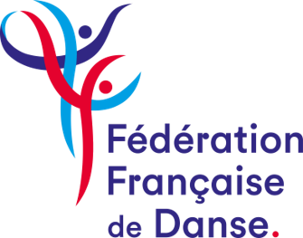
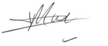
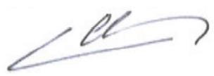
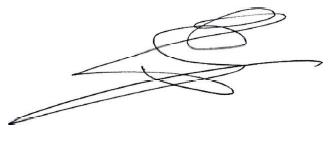

> **_RÈGLEMENT_** **_SPORTIF_** **_Applicable_** **_à_** **_compter_**
> **_du_** **_1er_** **_septembre_** **_2025_**
>
>  style="width:1.52986in;height:0.65329in" /> style="width:1.56375in;height:0.55556in" /> style="width:1.47778in;height:0.62761in" />**_Danses_** **_Latines_**
> **_Danses_** **_Standards_**

Table des matières

**Chapitre** **1** **-** **Les** **spécialités** **et** **les**
**danses**
**......................................................................................................3**
Article 1 Les
spécialités.......................................................................................................................................................
3 Article 2 Répartition des
danses..........................................................................................................................................
3 Article 3 Les figures et tenues
autorisées............................................................................................................................
4

**Chapitre** **2** **-** **Les** **Couples,** **les** **Classes**
**d’âge** **et** **les** **séries**
**............................................................................5**
Article 4 Les couples et
solos..............................................................................................................................................
5 Article 5 Les classes
d’âge..................................................................................................................................................
5 Article 6 Les
niveaux...........................................................................................................................................................
7 Article 7 Changement de niveau
.........................................................................................................................................
7

**Chapitre** **3** **-** **Le** **«** **Passeport** **Danse** **»**
**...............................................................................................................8**

**Chapitre** **4** **-** **Les**
**compétitions..........................................................................................................................9**
4.1 - Dispositions générales
............................................................................................................................9
Article 8 Type de
compétitions.............................................................................................................................................
9

> Article 9 Participation aux épreuves
> ....................................................................................................................................
> 9 Article 10 Le Directeur de
> compétition.................................................................................................................................
> 10 Article 11 Organisation des
> épreuves...................................................................................................................................11
> Article 12 Résultats et
> récompenses....................................................................................................................................11
> Article 13 Réclamations
> .......................................................................................................................................................11
>
> 4.2 - Les championnats de
> France................................................................................................................12
>
> 4.2.1 -Article 14

Dispositions communes aux championnats de
France.........................................................................
12 Les Championnats de
France..............................................................................................................................
12

> 4.2.2 - Parcours de sélection aux championnats de France Latines et
> Standards (couples et solos) ............. 13 Article 15
> Sélection.............................................................................................................................................................
> 13
>
> 4.3 - Le classement TOP DANSE et la coupe de France
> .............................................................................13
> Article 16 Les
> épreuves.......................................................................................................................................................
> 13
>
> 4.4 - Les Critériums
> nationaux.......................................................................................................................14
> 4.5 - Les « E-Compétition
> »...........................................................................................................................14

**Chapitre** **5** **-** **Dispositions** **particulières** **pour**
**les**
**Dom-Tom.........................................................................15**

**Chapitre** **6** **-** **Le** **corps** **arbitral** **des**
**compétitions...........................................................................................16**
Article 17 Le chairperson
....................................................................................................................................................
16 Article 18 Le
scrutateur.......................................................................................................................................................
16 Article 19 Le
juge................................................................................................................................................................
17 Article 20 Composition des jurys de compétition
.................................................................................................................
17

> ANNEXE 1 Classe
> d’âge.............................................................................................................................................
> 19
>
> ANNEXE 2 Championnats de France Parcours vers les titres de Champion
> de France............................................. 21
>
> ANNEXE 3 Changement de niveau Circuit des épreuves
> classificatrices...................................................................
> 23

Page 2 FFDanse – Reglement Sportif Danses Latines et Standards
applicable a compter du 1er septembre 2025

**Chapitre** **1** **-** **Les** **spécialités** **et** **les**
**danses**

**Article** **1** **Les** **spécialités**

1\. Il existe deux spécialités, les danses « **Latines** » et les danses
« **Standards** » :

||
||
||
||
||
||
||
||

**Article** **2** **Répartition** **des** **danses**

Les **compétitions** **majeures** **(sauf** **critériums**
**nationaux)** **doivent** **proposer** **dans** **chaque** **épreuve**
**toutes** **les** **danses** du **niveau** **supérieure** de la classe
d’âge concernée. **Les** **couples** participants à ces épreuves,
**doivent** **présenter** **toutes** **les** **danses** proposées.

Les autres compétitions proposées par la FFDanse ont des
caractéristiques destinées à favoriser l’apprentissage des spécialités
et des danses de compétition tout en permettant une progression
personnalisée de chaque compétiteur. Cette répartition s’appuie sur une
identification précise des niveaux qui permet à chacun de danser en
compétition à son niveau.

> Pour ces épreuves, les danses à exécuter, selon les niveaux, sont
> détaillées dans le tableau suivant :

||
||
||
||
||
||
||
||
||
||
||
||
||
||
||

Pour les **épreuves** **Opens**, les **danses** **proposées** doivent
être précisées **sur** **la** **circulaire** annonçant la compétition.

Il est possible d’exécuter tout ou partie de ces danses en les
regroupant en une prestation par couple (show danse) ou par équipe (solo
danse team).

FFDanse – Reglement Sportif Danses Latines et Standards applicable a
compter du 1er septembre 2025 Page 3

**Article** **3** **Les** **figures** **et** **tenues** **autorisées**

1\. Lors des épreuves de **_niveau_** **débutant** **et**
**Intermédiaire**, les **figures** **sont** **limitées**. Les couples
exécutent dans chaque danse un enchaînement librement chorégraphié à
partir des listes des figures autorisées et **des** **règles**
**définies** **au** **règlement** **technique** (ANNEXE 1 du RT).

2\. Pour **l’ensemble** **des** **niveaux**, les **règles** **sur**
**les** **tenues** en vigueur dans les épreuves régies par la FFDanse
**sont** **définies** **au** **règlement** **technique** (ANNEXE 2 du
RT)

3\. Pour les épreuves « **Show** **danse** » et « **Solo** **danse**
**team** », les **règles** **particulières** sur les tenues et les
figures sont précisées dans le chapitre traitant de ces épreuves dans
**le** **règlement** **technique**

Page 4 FFDanse – Reglement Sportif Danses Latines et Standards
applicable a compter du 1er septembre 2025

**Chapitre** **2** **-** **Les** **Couples,** **les** **Classes**
**d’âge** **et** **les** **séries**

Préambule :

> L’annéecivile deréférence (du1erjanvier au31 décembre) commence quatre
> mois aprèsle début de la saison sportive.
>
> Tout compétiteur doit avoir au **minimum** **6** **ans** dans l’année
> civile de référence.

**Article** **4** **Les** **couples** **et** **solos**

**Les** **couples**

Il existe **deux** **types** **de** **couples**. Ils peuvent être
constitués d’un partenaire masculin et d’un partenaire féminin, de deux
partenaires de même sexe. Chaque type de couple donnera lieu à
l’organisation de compétitions à des dates différentes.

Pour chaque type de couple, les partenaires doivent être les mêmes dans
les deux spécialités (Latines et Standards). Quelle que soit la date,
tout changement de partenaire doit être signalé immédiatement par écrit
au responsable du suivi des couples.

Chaque couple est classé dans une classe d’âge et, pour chaque
spécialité, dans un niveau.

**Chaque** **danseur(se)** **d’un** **couple** doit être titulaire au
**minimum** **de** **la** **licence** **C** (titre découverte minimum
pour le niveau débutant).

**Les** **solos**

||
||
||
||
||

||
||
||
||

**Article** **5** **Les** **classes** **d’âge**

Chaque couple ou solo est placé dans **la** **classe** **d'âge** définie
en fonction des années de naissance. Elles sont fixées au début de
l’année civile pour toute l’année civile.

**<u>LES COUPLES</u>**

L’âge retenu est celui des partenaires au 31 décembre de référence :

> \- **Juvénile** **I** :
>
> \- **Juvénile** **II** :

**9** **ans** ou moins pour le plus âgé des deux partenaires,

**11** **ans** ou moins pour le plus âgé des deux partenaires,

> \- **Junior** **I** :
>
> \- **Junior** **II** :

**12** **et** **13** **ans** pour le plus âgé des deux partenaires,

**14** **et** **15** **ans** pour le plus âgé des deux partenaires,

> \- **Youth** :
>
> \- **Adulte** :

**16,** **17,** **et** **18** **ans** pour le plus âgé des deux
partenaires,

**19** **ans** **ou** **plus** pour le plus âgé des deux partenaires,

> \- **Senior** **I** :
>
> \- **Senior** **II** :
>
> \- **Senior** **III**
>
> \- **Senior** IV
>
> \- **Senior** **V**:

**35** **ans** ou plus pour le plus âgé des partenaires

**et** **30** **ans** ou plus pour le plus jeune des deux partenaires,

**45** **ans** ou plus pour le plus âgé des partenaires

**et** **40** **ans** ou plus pour le plus jeune des deux partenaires,

: **55** **ans** ou plus pour le plus âgé des partenaires

**et** **50** **ans** ou plus pour le plus jeune des deux partenaires,

: **65** **ans** ou plus pour le plus âgé des partenaires

**et** **60** **ans** ou plus pour le plus jeune des deux partenaires.

**70** **ans** ou plus pour les deux partenaires.

Quelques définitions

> \- Le terme « **Jeune** » recouvre les classes **Juvénile** **I**,
> **Juvénile** **II**, **Junior** **I** et **Junior** **II.** - Le terme
> « **Juvénile** » recouvre les classes **Juvénile** **I**, **Juvénile**
> **II**.
>
> \- Le terme « **Junior** » recouvre les classes **Junior** **I** et
> **Junior** **II**.
>
> \- Le terme « **Espoir** » nommé « **Under** **21** » par la WDSF
> recouvre les couples « Youth » et les couples « Adulte » dont les
> **deux** **partenaires** **ont** **moins** **de** **21** **ans** au 31
> décembre de l’année de référence.
>
> \- Le terme « **Senior** » recouvre les classes **Senior** **I**,
> **Senior** **II**, **Senior** **III**, **Senior** **IV** et **Senior**
> **V.**

FFDanse – Reglement Sportif Danses Latines et Standards applicable a
compter du 1er septembre 2025 Page 5

> **<u>LES SOLOS</u>**
>
> L’âge retenu est celui du danseur ou de la danseuse au 31 décembre de
> référence :

||
||
||
||
||

Un tableau récapitulatif des classes d’âge figure à l’ANNEXE 1

Page 6 FFDanse – Reglement Sportif Danses Latines et Standards
applicable a compter du 1er septembre 2025

> **Article** **6** **Les** **niveaux**

Chaque classe d'âge est subdivisée en niveaux suivant le tableau
ci-après :

> Types d’équipe
>
> **Couple**
>
> **Couple**
>
> **Solo**

Classes d’âge International

> **Juvénile** **I**
>
> **Juvénile** **II**
>
> **Juvénile**
>
> Niveaux

Avancé Intermédiaire

> x
>
> x
>
> X

Débutant~~\*~~

> X
>
> X
>
> **Couple** **et** **solo**
>
> **Couple** **et** **solo**
>
> **Couple**
>
> **Couple**
>
> **Solo**
>
> **Solo**
>
> **Solo**
>
> **Couple**
>
> **Couple**
>
> **Couple**
>
> **Couple**
>
> **Couple**
>
> **Junior** **I** X x
>
> **Junior** **II** X x
>
> **Youth** X x
>
> **Adulte** X X x
>
> **Youth** X X
>
> **Adulte** X X
>
> **Senior** X X
>
> **Senior** **I** X X X
>
> **Senior** **II** X X X
>
> **Senior** **III** X X X
>
> **Senior** **IV** X X X

**Senior** **V** **(Std)** X X X

X

X

X

X

X

X

2\. Larépartition par niveause fait séparément pour chaque spécialité
(Ex: niveau avancé en Latineset débutant en Standards).

**Article** **7** **Changement** **de** **niveau**

1\. Les **changements** **de** **niveau** ont lieu **au** **début**
**de** **chaque** **saison** **sportive** **:**

||
||
||
||
||

FFDanse – Reglement Sportif Danses Latines et Standards applicable a
compter du 1er septembre 2025 Page 7

**Chapitre** **3** **-** **Le** **«** **Passeport** **Danse** **»**

Le « **Passeport** **Danse** » (créé à partir de la saison 2018-2019) se
compose de 9 couleurs avec 7 échelons qui valident le niveau technique
de chaque danseur et danseuse.

Le « **Passeport** **Danse** **Latine** **/** **Standard** » peut être
délivré à tout licencié de la FFDanse qui désire passer les évaluations
techniques définies au chapitre 3 du règlement technique, même si ce
licencié ne participe pas aux compétitions de danses Latines et
Standards organisées par la FFDanse.

Page 8 FFDanse – Reglement Sportif Danses Latines et Standards
applicable a compter du 1er septembre 2025

**Chapitre** **4** **-** **Les** **compétitions**

4.1 - Dispositions générales

<u>Préambule</u>

> Une **manifestation** est la **globalité** **d’une** **organisation**
> (compétition et autres événements). Une **compétition** est
> **l’ensemble** **des** **épreuves** sportives d’une manifestation.
>
> Une **épreuve** est **l’ensemble** **des** **tours** nécessaires à
> déterminer un vainqueur et un classement des concurrents. Une épreuve
> ne peut avoir lieu que si au moins deux couples sont en lice.
>
> Une épreuve peut être composéeuniquement dedanseslatinesoustandards,
> oufaire l’objet d’unclassement combiné ou d’une épreuve supplémentaire
> (latines + standards) appelée « 10 danses ».
>
> Pour les compétitions internationales, ou lorsque le jury est composé
> de juges étrangers, les informations doivent pouvoir être réalisées en
> anglais.

**Article** **8** **Type** **de** **compétitions** Les compétitions
pouvant être organisées sont :

**<u>LES COMPETITIONS DE PROXIMITE</u>**

Les règlements généraux définissent l’aire géographique de ces
compétitions.

Au choix de l’organisateur, **des** **épreuves** **classificatrices**
pour les **niveaux** **débutant** et **intermédiaire**, peuvent être
organiséesainsiquedesépreuves« **Open** »
sanslimitationdeniveau,desépreuvesconcernant leslicenciés loisir, des
solo team ou des épreuves de danse en solo.

**<u>LES COMPETITIONS NATIONALES</u>**

**Tous** **les** **types** **d’épreuves** (épreuves classificatrices,
opens nationaux, danse en solo et solo team) peuvent être organisés
**au** **choix** de l’organisateur.

**<u>LES COMPETITIONS MAJEURES</u>**

**Elles** **comprennent**, d’après les règlements généraux, **les**
**épreuves** **conduisant** **au** **titre** **de** **champion** **de**
**France**. Les **critériums** **nationaux** sont **assimilés** **à**
**ces** **compétitions** **majeures** pour l’application des
dispositions du présent règlement sportif et du règlement technique des
danses latines et standards.

**<u>LES COMPETITIONS INTERNATIONALES</u>**

**Les** **compétitions** **internationales** sont des **compétitions**
regroupant des participants de plusieurs pays. Pour ces compétitions, la
règlementation WDSF s’applique.

**Article** **9** **Participation** **aux** **épreuves** Dans toutes les
compétitions :

> \- Les couples **Juvénile** **I** **peuvent** **participer** également
> aux épreuves **Juvénile** **II**, - Les couples Junior I peuvent
> participer également aux épreuves **Junior** **II**,
>
> \- Les couples **Senior** **V** **peuvent** **participer** **en**
> **Latines** aux épreuves **Senior** **IV**.

1\. **<u>EPREUVES MAJEURES</u>** (cf. schéma à l’annexe 2)

1.1. Dans **chaque** **classe** **d’âge**, toutes les épreuves sont
**ouvertes** **à** **tous** **les** **niveaux**.

||
||
||
||

1.3. Un couple peut choisir de danser dans une classe différente de sa
classe d’âge tel que défini ci-après : ➢ Un couple **Junior** **II**
peut choisir de participer en **Youth**.

> ➢ Un couple **Youth** peut choisir de participer en **Espoir** ou en
> **Adulte**
>
> ➢ Un couple **Adulte** peut choisir de participer en **Espoir** s’il
> remplit les conditions d’âge ➢ Un couple **Senior** **I** peut choisir
> de participer en **Adulte**
>
> ➢ Un couple **Senior** **II** peut choisir de participer en **Senior**
> **I** ➢ Un couple **Senior** **III** peut choisir de participer en
> **Senior** **II** ➢ Un couple **Senior** **IV** peut choisir de
> participer en **Senior** **III** ➢ Un couple **Senior** **V** peut
> choisir de participer en **Senior** **IV**

FFDanse – Reglement Sportif Danses Latines et Standards applicable a
compter du 1er septembre 2025 Page 9

||
||
||
||
||
||

||
||
||
||
||

2\. **<u>ÉPREUVES CLASSIFICATRICES</u>** (cf. schéma à l’annexe 3)

> Dans les **épreuves** **classificatrices**, un couple ne **peut**
> **participer** qu'aux épreuves organisées pour **sa** **classe**
> **d'âge** **et** **son** **niveau**.

3\. **<u>OPENS NATIONAUX OU INTERNATIONAUX</u>**

> 3.1. Il est possible d’organiser des épreuves **Open** regroupant
> **soit** **des** **classes** **d'âge**, **soit** **des** **niveaux**,
> **soit** **les** **deux**. Il est également possible d’intégrer
> progressivement les couples selon leurs niveaux. Les couplespeuvent
> participerà toutes les épreuvesOpen englobant leurclassed'âge et
> leurniveau.
>
> 3.2. Les **compétiteurs** **étrangers** non licenciés FFDanse mais
> **détenteurs** **d’une** **licence** **d’une** **fédération**
> **membre** **de** **la** **WDSF** peuvent participer aux épreuves
> **nationales** **Opens** autorisées par la FFDanse.
>
> 3.3. Les **Opens** **internationaux** ne peuvent s’organiser seulement
> qu’au sein d’une compétition internationale WDSF.
>
> 3.3.1.Les droits de dossard sont fixés par l’organisateur.

4\. **<u>TOURNOI SUR INVITATION</u>**

> Les couples **Seniors** **I** **&** **II** de **niveau**
> **International**, **Youth** niveau **avancé** peuvent danser avec les
> couples **Adulte**.

Tous les couples invités doivent recevoir le remboursement de leur
voyage et doivent être logés et nourris. 4.1. **Tournoi** **national**

> Un **tournoi** **national** sur invitation est une épreuve qui réunit
> des couples **d’au** **moins** **trois** **structures** affiliées
> différentes, dont la structure organisatrice. L'organisateur invite
> les couples de son choix.

4.2. **Tournoi** **international**

> Il doit réunir au moins **4** **nations** membres de la **WDSF**.
> L’organisateur **doit** **inviter** **le** **champion** **de**
> **France** (latines, standards ou 10 danses) **et** un **minimum**
> **de** **5** **couples** **français** de son choix (avec un minimum de
> 3 couples de niveau international).

5\. **<u>EPREUVE « SOLO DANSE TEAM »</u>**

> **Chaque** **équipe** doit être composée d’un nombre de danseurs
> **minimum** **de** **6** ; il est possible de prévoir des remplaçants.
> Cette épreuve peut être organisée dans **toutes** **les**
> **compétitions** **de** **proximité** **ou** **nationales**.
>
> Il est possible de proposer des épreuves « **Juvénile** », «
> **Junior** », « **Adulte** » et « **Seniors** » (l’âge pris en compte
> est celui de l’âge moyen, arrondi à l’unité supérieure des danseurs de
> l’équipe. Pour les séniors, l’âge pris en compte est 30 ans).
>
> **La** **réglementation** concernant le « **Solo** **Danse** **Team**
> **»** figure au chapitre 4.2.3 du **règlement** **technique**.

6\. **<u>EPREUVE « SHOW DANSE »</u>**

> La **réglementation** concernant les « **show** **danse** » fait
> l’objet de l’article 16 du **règlement** **technique**.

7\. **<u>EPREUVE « SOLO »</u>**

||
||
||
||

**Article** **10** **Le** **Directeur** **de** **compétition**

Un **directeur** **de** **compétition** doit être désigné **pour**
**toute** **compétition** inscrite au calendrier fédéral. Il est **le**
**représentant** **de** **la** **structure** organisatrice **auprès**
des **autorités** **fédérales**, du **corps** **arbitral** et des
**danseurs**.

> \- Il est **choisi** **par** **l’organisateur** (sauf pour
> championnats de France, Coupes de France et les Critériums Nationaux)
> et le représente auprès des autorités fédérales, du chairperson, des
> danseuses ou des danseurs.
>
> \- Il doit posséder **une** **licence** **FFDanse** et figurer **sur**
> **la** **liste** **des** **directeurs** **de** **compétition** agréés
> par la FFDanse.
>
> ~~-~~ Il **peut** être **présentateur**.
>
> \- Dans une compétition dite de proximité, il peut occuper un poste du
> corps arbitral (chairperson, juge ou scrutateur s’il en a la qualité)
> sauf s’il est en même temps présentateur.

Page 10 FFDanse – Reglement Sportif Danses Latines et Standards
applicable a compter du 1er septembre 2025

> \- Il est **responsable** du choix des **musiques** auprès des
> autorités fédérales et du corps arbitral. - Il doit être
> **physiquement** **présent** tout au long de la manifestation.
>
> \- Il **compose** **le** **corps** **arbitral** en accord avec
> l’organisateur (sauf compétitions majeures). - Il fait valider
> l’horaire prévisionnel par le chairperson.
>
> \- Il doit transmettre, ou s’en assurer, les résultats de la
> compétition au responsable du suivi des couples.

**Article** **11** **Organisation** **des** **épreuves** **1.**
**<u>ORGANISATION DES TOURS</u>**

> 1.1. Pour le premier tour :
>
> \- L’organisation de **1/2** **finales** est obligatoire à partir de -
> L’organisation de **1/4** **finales** est obligatoire à partir de -
> L’organisation de **1/8** **finales** est obligatoire à partir de -
> L’organisation de **1/16** **finales** est obligatoire à partir de
>
> \- L’organisation de **1/32** **finales** est obligatoire à partir de

**8** **couples**. **15** **couples**. **29** **couples**. **57**
**couples**.

**113** **couples**.

> 1.2. Lors des tours suivants, **chaque** **tour** doit comprendre au
> **minimum** **la** **moitié** **des** **participants** du tour
> précédent **à** **une** **unité** **près**. Donc au cours de
> l’épreuve, le nombre minimum de couples à retenir est de :
>
> \- Si le **nombre** **de** **couples** est **pair** : la **moitié**
> des participants **moins** **1**
>
> \- Si le **nombre** **des** **couples** est **impair** : la **moitié**
> des participants **moins** **0,5**
>
> 1.3. En **finale**, le nombre de couples **ne** **pourra** **être**
> **supérieur** **à** **8**. Il n’y aura 7 ou 8 couples en finale qu’en
> cas d’égalité absolue.
>
> Si, après application de la règle ci-dessus, on obtient plus de 8
> couples, le nombre minimum requis conformément aux dispositions du
> point 1.2 ci-dessus n’est pas appliqué.
>
> 1.4. Il doit y avoir un **intervalle** **d’au** **moins** **15**
> **minutes** **entre** **les** **tours** d’une même épreuve.

**2.** **<u>NOMBRE D’ÉPREUVES SIMULTANEES</u>**

> 2.1. **Deux** **épreuves** **jugées** peuvent se dérouler
> **simultanément** sur la même piste, mais le nombre total de couples
> en piste **ne** **doit** **pas** **dépasser** **7**.

**_3._** **<u>DÉPOUILLEMENT DES MARQUES ET CLASSEMENT</u>**

> 3.1. **Le** **classement** et le départage des couples se font suivant
> les **règles** **du** **Skating** **System.** 3.2. Le jugement se fait
> à **notes** **fermées**.
>
> 3.3. Toutes les **marques** **des** **couples** **éliminés** doivent
> être **affichées** à chaque épreuve et au plus tard 10 minutes avant
> le tour suivant de l’épreuve.
>
> 3.4. **Si** **un** **ou** **des** **couples** se voient dans
> l’**obligation** **d’abandonner** **la** **compétition**, sur avis
> favorable du chairperson, ils conservent toutes les marques qu’ils ont
> acquises dans les tours et danses déjà effectués. En finale, ils sont
> **classés** **derniers** **pour** **les** **danses** qu’ils n’ont pas
> pu danser et **sont** **classés** **au** **classement** **final**.

**Article** **12** **Résultats** **et** **récompenses**

> 1.1. Les **résultats** des épreuves des classes d’âge **Jeunes**
> doivent être proclamés **au** **plus** **tard** **à** **22h30**.
>
> 1.2. Pour les **Critériums** **Nationaux** et les **Coupes** **de**
> **France**, l’organisateur est **libre** **de** **choisir** **les**
> **récompenses** remises, le **minimum** imposé étant **deux**
> **coupes** pour le couple vainqueur des classes d’âge **Jeunes**
> **et** **Youth** et **une** **coupe** pour le couple vainqueur dans
> les **autres** **classes** **d’âge.**
>
> Les **frais** des récompenses sont à la **charge** **de**
> **l’organisateur**.
>
> 1.3. Pour toutes les **autres** **compétitions** FFDanse
> l’organisateur **est** **libre** **de** **choisir** les récompenses
> remises, le **minimum** imposé étant deux médailles pour **chaque**
> **couple** **du** **podium** dans toutes les classes d’âge et niveaux.
> Les **frais** des récompenses **sont** **à** **la** **charge** **de**
> **l’organisateur**.

**Article** **13** **Réclamations**

1\. Les **délais** de réclamation sont de **10** **minutes** **après**
**l’affichage** des résultats. Le tour suivant de l’épreuve ne peut
débuter qu’après la décision prise et portée à la connaissance de tous.

FFDanse – Reglement Sportif Danses Latines et Standards applicable a
compter du 1er septembre 2025 Page 11

4.2 - Les championnats de France

4.2.1 - **Dispositions** **communes** **aux** **championnats** **de**
**France**

Les **règles** **d’attribution** des organisations des **Championnats**
**de** **France** sont fixées par les **Règlements** **généraux**. Le
**Directeur** **de** **compétition** **est** **désigné** par la
**fédération**.

**Article** **14** **Les** **Championnats** **de** **France**

Le principe général de l'organisation et de la participation au
Championnat de France est le suivant :

1\. Chaque année, il est décerné **un** **titre** **de** **champion**
**de** **France** Latine, Standard et 10 danses dès lors que **trois**
**couples** **sont** **en** **lice**.

2\. Il est organisé **une** **épreuve** de **Championnat** **de**
**France** pour **toutes** **les** **classes** **d’âges**

3\. Il est également **décerné** un titre de **champion** **de**
**France** **Espoir** en **Latine**, **Standard** et **10** **danses**.

4\. Leschampionnats de France peuvent faire l'objet de
plusieursorganisationsséparéesquiont lieu à des dates différentes :

> 4.1. Les **championnats** **de** **France** **de** **Danses**
> **Latines** **&** **Standards** doivent se dérouler le **même**
> **jour** **ou** **sur** **deux** **jours** **accolés** entre le
> **1er** **avril** et le **30** **juin**.
>
> Pour **participer** au **Championnat** **de** **France** Latines &
> Standards, **tous** **les** **couples** doivent suivre **le**
> **parcours** **de** **sélection** défini à l’article 15 ci-après (cf.
> schéma à l’annexe 2).
>
> 4.2. Le **championnat** **de** **France** **«** **Professional**
> **Division** **»** **Standards** doit se dérouler le même jour que le
> **championnat** **de** **France** **adulte** **Latines**.
>
> Le **championnat** **de** **France** **«** **Professional**
> **Division** **»** **Latines** doit se dérouler le même jour que le
> **championnat** **de** **France** **adulte** **Standards**.
>
> 4.3. Le **championnat** **de** **France** **10** **Danses** (6 danses
> en Juvénile I, 8 danses en Juvénile II) **doit** **se** **dérouler**
> pendant **l'année** **sportive** dans **toutes** **les** **classes**
> **d’âge** à l’**exception** de la classe d’âge **Senior** **V**.
>
> Tous les couples **Adulte**, **Senior** **I**, **Senior** **II**,
> **Seniors** **III** **et** **IV** de niveau **intermédiaire**,
> **avancé** ou **international** dans les **deux** **spécialités**
> **peuvent** **participer** à ce Championnat. Les championnats
> **Youth**, **Junior** **II**, **Junior** **I**, **Juvénile** **II** et
> **Juvénile** **I** ne font **pas** l'objet **de** **sélection**
> **particulière**.
>
> 4.4. Le **championnat** **de** **France** **Show** **Dance** doit se
> dérouler le **même** **jour** que le **championnat** **10** **Danses**
> et dans la classe d’âge **Adulte** **uniquement**.
>
> **Tous** **les** **couples,** licenciés FFDanse, des classes d’âge
> **Youth**, **Adulte** et **Senior** **I** de niveau **avancé** et
> **international** **peuven**t **participer** à ce **championnat** en
> **Latines** **et/ou** **Standards**.
>
> 4.5. Le **championnat** **de** **France** **«** **solo** **danse**
> **team** **»** **doit** **se** **dérouler** entre le **1er** **avril**
> et le **30** **juin**. Il peut être organisé **en** **même** **temps**
> que les **Critériums** **nationaux**.
>
> **Tous** **les** **teams** **peuvent** **s’inscrire** dès lors qu’ils
> **ont** **participé** **à** **au** **moins** **une** **compétition**
> dans la saison **sauf** pour les **Dom-Tom** et la **Corse** qui
> devront **fournir** **une** **vidéo** de leur prestation afin de la
> valider **au** **plus** **tard** **15** **jours** **avant** les
> championnats de France.
>
> 4.6. Le **Championnat** **de** **danse** **en** **solo** peut se
> dérouler le **même** **jour** que les **Championnats** **Latine**
> **et** **Standard.**

Aucune épreuve annexe (hors championnat de France solo) ne peut être
organisée lors des championnats de France latines, standards et 10
danses.

Page 12 FFDanse – Reglement Sportif Danses Latines et Standards
applicable a compter du 1er septembre 2025

4.2.2 - **Parcours** **de** **sélection** **aux** **championnats**
**de** **France** **Latines** **et** **Standards** **(couples** **et**
**solos)**

**Article** **15** **Sélection**

Pour **participer** **au** **Championnat** **de** **France** Latines ou
Standards, tous les **couples** **et** **solos** **doivent** suivre le
**parcours** **sélectif** suivant (cf. schéma à l’annexe 2)

> 1.1. Dans les classes d’âges **Juvénile** et **Junior** **I**, les
> couples participant au championnat régional sont **automatiquement**
> **sélectionnés** pour le Championnat de France.
>
> 1.2. Pour les couples, dans les **autres** **classes** **d’âge**
> **et** **en** **espoir**, la participation au **championnat**
> **régional** est également obligatoire pour figurer sur la liste des
> couples sélectionnables. Le **classement** **Top** **Danse** (Article 16) permet de déterminer **le** **classement** **des** **couples**
> **sélectionnables** pour le Championnat de France à concurrence du
> nombre de couples à sélectionner.

||
||
||
||
||

> 1.4. Si, **exceptionnellement**, il doit être organisé une **Coupe**
> **de** **France** **le** **même** **week-end** qu’un **championnat**
> **régional**, la participation au **championnat** **régional** reste
> **obligatoire**.
>
> Si **les** **couples** **de** **cette** **région** ont participé à
> **une** **seule** **épreuve** sur les trois prises en compte, leur
> participation au **championnat** **régional** **validera** aussi leur
> **participation** **à** **la** **coupe** **de** **France** du même
> week-end.

Le **nombre** **de** **couples** **et** **solos** **à** **sélectionner**
pour les championnats de France **est** **fixé** chaque année **par**
**la** **DTN.**

4.3 - Le classement TOP DANSE et la coupe de France

**Article** **16** **Les** **épreuves**

**Apartir** de la classe **Junior** **II** **(uniquement** **en**
**Standards** **pour** **la** **classe** **«** **Senior** **V** **»)**,
**un** **classement** « **TOP** **DANSE** » par spécialité et classe
d’âge, ainsi que pour les espoirs, **est** **établi** sur les **trois**
**dernières** épreuves de la **coupe** **de** **France**. Le classement
est réalisé sur les **deux** **meilleurs** **résultats** obtenus (nombre
de points acquis) **sauf** pour les **Junior** **II** (**un** **seul**
**résultat** pris en compte).

Les **organisations** des Coupes de France sont **réparties** aussi
**uniformément** que possible sur l’ensemble du **territoire**.
**Chaque** **organisateur** doit obligatoirement programmer
**l'ensemble** **des** **épreuves** des deux spécialités. **Une**
**seule** **Coupe** **de** **France** pourra être **organisée** pendant
le **dernier** **trimestre** **de** **l’année** **civile**.

**Les** possibilités de **participation** aux Coupes de France pour
**chaque** **classe** **d’âge** sont **celles** des **championnats**
**de** **France**.

**Aucune** **compétition** ou **épreuve** **annexe** ne peut être
**organisée** à partir du moment où la **première** **épreuve** de
**la** **Coupe** **de** **France** s'est **déroulée**.

Le **classement** de la **coupe** **de** **France** est le classement «
**TOP** **DANSE** » au **31** **août** de chaque année.

FFDanse – Reglement Sportif Danses Latines et Standards applicable a
compter du 1er septembre 2025 Page 13

4.4 - Les Critériums nationaux

> **Des** **épreuves** latines et standards doivent être organisées dans
> **toutes** les classes d’**âge** et **niveaux**, à **l'exception** du
> niveau **international**.
>
> Toutes les classes d’**âge** seront **réparties** **sur** **le**
> **week-end** (par ex : Jeunes, Youths et Adultes le samedi et Seniors
> le dimanche).
>
> Sont **autorisés** à participer aux Critériums Nationaux, tous **les**
> **couples** **licenciés** (licence C ou D ; **titre** **découverte**
> au minimum pour les couples de niveau débutant) à la FFDanse.
>
> Lorsdescritériums nationaux, **un** open latine(**Trophée** **de**
> **France**)et un open standard (**Trophéede** **France**) pour
> **chaque** classe d’**âge** sont organisés (licence C ou D
> obligatoire). Ces opens sont ouverts à **toutes** les classes
> d’**âge** et **niveaux**, à **l'exception** du niveau
> **international.**
>
> Le **directeur** **de** **compétition** est **désigné** par
> **l'organisateur** mais doit être **approuvé** par les **conseillers**
> de la discipline.

4.5 - Les « E-Compétition »

> Des **compétitions** par **vidéo** « **E-compétitions** » peuvent être
> **organisées** sous **l’égide** de la **FFDanse**.
>
> Une **compétition** par vidéo n’a **pas** **pour** **but**
> **principal** de **remplacer** les **compétitions** **en**
> **présentiel**. Elle peut **palier** **à** **l’impossibilité**
> d’organiser ou **compléter** **l’offre** **habituelle** en présentiel.
>
> Elle se **différencie** principalement des **«** **E-concours** » par
> **l’obligation** de r**especter** **la** **réglementation**
> **sportive** (règlements généraux et des disciplines) et du corps
> arbitral.
>
> Les **dispositions** **particulières** à ce typed’organisation sont
> préciséesà l’annexe 8 du **règlementtechnique** **latines/standards**.

Page 14 FFDanse – Reglement Sportif Danses Latines et Standards
applicable a compter du 1er septembre 2025

**Chapitre** **5** **-** **Dispositions** **particulières** **pour**
**les** **Dom-Tom**

Les **dispositions** de ce chapitre **se** **substituent**, pour les
couples, solos ou teams des **DOM-TOM**, aux dispositions du règlement
sportif et du règlement technique traitant du même sujet.

**1.** **<u>CHANGEMENT DE SERIE</u>**

> Tout **couple** ayant **participé** à **trois** **épreuves**
> **importantes** dans le niveau **avancé** (sans disqualification) et
> classé dans les **premiers** **50%** de chaque épreuve est **admis**
> au niveau **international** **sauf** **avis** **contraire** du
> **responsable** **technique** de la structure.

**2.** **<u>QUALIFICATION AUX CHAMPIONNATS DE FRANCE</u>**

> Tout couple **Champion** **de** **région** est **qualifié** pour le
> **championnat** **de** **France** de la spécialité.

**3.** **<u>JURY DES COMPETITIONS</u>**

> Le **jury** des **compétitions** dans les DOM-TOM doit être composé de
> **3** **juges** **minimum**.

FFDanse – Reglement Sportif Danses Latines et Standards applicable a
compter du 1er septembre 2025 Page 15

**Chapitre** **6** **-** **Le** **corps** **arbitral** **des**
**compétitions**

1\. Le **corps** **arbitral** d’une compétition comprend le
**chairperson** (1 par piste), le **scrutateur** et les **juges**.

2\. Pour les **compétitions** **FFDanse** ou **internationales** non
inscrites au calendrier WDSF, les **juges** doivent figurer sur la
**liste** **officielle** de la **FFDanse** **ou** **de** la **WDSF** ou
sur la liste des **fédérations** **affiliées** à la **WDSF**.

3\. Pour les **compétitions** **majeures** **nationales**, les membres
du **corps** **arbitral** sont **nommés** par la **commission** du
**corps** **arbitral**. Ils doivent **arriver** **la** **veille** de la
compétition **sauf** **accord** du **chairperson**. Ils se
**restaurent** **ensemble** et sont **logés** dans le **même**
**hôtel**.

> Pour les **championnats** **départementaux** et **régionaux**, les
> membres du **corps** **arbitral** sont **nommés** par le **comité**
> **territorial** **organisateur**.
>
> Pour toutes les **autres** **compétitions**, les membres du **corps**
> **arbitral** sont **nommés** par le **Directeur** **de**
> **compétition** en accord avec l’organisateur.

**Article** **17** **Le** **chairperson**

1\. Le **Chairperson** (président du corps arbitral) **est** le
responsable des **juges** **et** des scrutateurs ; il les **représente**
**auprès** du **directeur** **de compétition**. Il ne doit **pas**
**être** **partenaire**, ni **conjoint**, ni **licencié** dans la
**même** **structure** affiliée, ni de la **même** **école** **que**
**l’organisateur** **ou** que le **directeur** **de** **compétition**.

> \- Il est **non** **votant** **sauf**, éventuellement, pour les
> **compétitions** **de** **proximité.** - Il doit figurer **sur**
> **la** **liste** **officielle** des Chairpersons de la **FFDanse**.
>
> \- Il **veille** à **l’application** des **règles** de l’arbitrage par
> les juges.
>
> \- Il a **toute** **autorité** pour **régler** les **incidents**
> **liés** à la **réglementation** de la compétition.
>
> \- **En** **cas** de **réclamation**, il peut **réunir** les membres
> du **jury** en commission extraordinaire pour **prendre** **une**
> **décision** dans le cadre de la compétition.
>
> \- Il est chargé **d’informer** **directement** **les** **couples** et
> le cas échéant (notamment pour les danseurs mineurs) le responsable
> technique (entraîneur) de la structure affiliée d’appartenance du
> couple des décisions exceptionnelles qu’il sera amené à prendre.
>
> \- Il **contrôle** les **tenues** **de** **danse**, les **figures**
> **autorisées**. Il avertit le couple s’il constate une infraction. En
> **cas** **de** **récidive**, il doit **déclasser** ou **disqualifier**
> le couple lors de l’épreuve ou de la danse concernée.
>
> \- Il **inspecte** **les** **marques** et contrôle les scrutateurs.
>
> \- Il doit **être** **physiquement** **présent** tout au long de la
> manifestation.
>
> \- Il **renseigne** **toute** **infraction** des couples sur le site
> [(<u>http://www.chairperson.ffdanse.fr</u>)](http://www.chairperson.ffdanse.fr/). -
> Il doit **faire** **un** **rapport** pour toutes les compétitions.
>
> \- Il **réalise** **ou** **valide** **les** **panels** des différentes
> épreuves de la compétition sauf pour les championnats de France.
>
> \- Il **valide** **l’horaire** **prévisionnel** de la manifestation.
>
> \- Pour les **compétitions** **de** **proximité**, la fonction de
> **Chairperson** **peut** **être** **assurée** par un **juge**
> détenteur de la carte de juge national ayant **suivi** **le**
> **dernier** **stage** annuel des **Chairpersons**.
>
> \- Dans le cas d'une **compétition** **regroupant** des **épreuves**
> **WDSF** et des **épreuves** **nationales**, les **Chairpersons**
> doivent être **différents**.

**Article** **18** **Le** **scrutateur**

Le **scrutateur** **gère** le **système** **de** **jugement**
**informatique** ou, en cas de jugement papier, saisit les notes des
juges dans un logiciel agréé par la FFDanse. Il doit y **avoir** **un**
**scrutateur** figurant sur la **liste** **officielle** **FFDanse** sur
chaque compétition ; en cas d’impossibilité, les règlements généraux du
corps arbitral ont prévu une mesure de suppléance.

**Si** **plusieurs** **pistes** sont mises en place, **un**
**scrutateur** **par** **piste** est **souhaitable** (obligatoire pour
les critériums nationaux).

**Hors** **Championnat** **de** **France**, **Critériums** **Nationaux**
et épreuve de la **Coupe** **de** **France**, le **nombre** **de**
**scrutateurs** officiels est **déterminé** par accord **entre** le ou
les **scrutateurs** **sollicités** et le **directeur** **de**
**compétition**. Toutefois, dans **les** **compétitions** avec des
épreuves dans lesquelles **7** **juges** officient simultanément,
**deux** **scrutateurs** sont nécessaires, **sauf** **si** les **PDA**
sont utilisés.

**Avant** **de** **solliciter** **un** **scrutateur** n’appartenant
**pas** au **corps** **arbitral** de la **FFDanse**, le **directeur**
**de** **compétition** doit présenter une **demande** auprès de la
**commission** **transversale** **du** **corps** **arbitral**.

Page 16 FFDanse – Reglement Sportif Danses Latines et Standards
applicable a compter du 1er septembre 2025

**Article** **19** **Le** **juge**

Le **titre** **de** **juge** est **exigé** pour les **compétitions**
**de** **proximité**, **nationales** et **majeures**.

Il comprend **trois** **niveaux** de qualification :

> \- **Départemental** (carte juge « Départemental ») est **autorisé** à
> **juger** **uniquement** les épreuves **Intermédiaire** ainsi que les
> **Opens** sur **des** **compétitions** **de** **proximité**.
>
> \- **Régional** (carte juge « Régional ») est **autorisé** à juger les
> **épreuves** **et** **open** comprenant les niveaux **débutant**,
> **intermédiaire** et **avancé** ainsi que les **opens** tous niveaux
> sur **des** **compétitions** **de** **proximité** et **les**
> **championnats** **régionaux**.
>
> \- **National** (carte juge « National ») est **autorisé** à juger
> **tous** **les** **niveaux**.
>
> \- **International**, le juge doit détenir la **carte** **juge**
> **National** et être **actif** sur la liste de la **WDSF**. Il peut
> **juger** **tous** les **niveaux** **d’épreuves** sur le territoire
> français. **La** **liste** des **juges** **français** « **WDSF** » est
> établie et **tenue** **à** **jour** par la **FFDanse** qui se réserve
> le droit de la modifier.

**Article** **20** **Composition** **des** **jurys** **de**
**compétition**

Les **juges**, qui **ont** **jugé** **le** **1er** **tour** d'une
épreuve, **jugent** **tous** **les** **tours** de cette épreuve
**jusqu'à** **la** **finale**.

**1.** **<u>COMPETITIONS DE PROXIMITE</u>**

> Pour les **compétitions** **de** **proximité,** le nombre **minimum**
> est de **3** **juges** FFDanse de niveau **départemental**
> **minimum**.

**2.** **<u>COMPETITIONS NATIONALES</u>**

> Pour les **compétitions** **nationales**, le nombre **minimum** est de
> **5** **juges** FFDanse de niveau **national**, plus **un** **juge**
> ffdanse de niveau **régional**.
>
> Pour les **épreuves** nationales de **solo** **danse** **team**, il
> est **aussi** prévu **un** **juge** FFDanse dédié au **chronométrage**
>
> Il est possible d’inclure des juges étrangers à la condition qu’ils
> soient WDSF ou licenciés au plus haut niveau national dans une
> fédération membre de la WDSF mais les juges FFDanse de niveau national
> doivent rester majoritaire.
>
> 2.1 Pour les tournois nationaux sur invitation, les juges FFDanse de
> niveau national doivent être au moins 3 et en majorité.
>
> 2.2 Pour les tournois internationaux sur invitation les juges FFDanse
> doivent être au moins de 2 et de niveau national, les autres juges
> doivent être soit WDSF soit licenciés au plus haut niveau dans une
> fédération membre de la WDSF.

**3.** **<u>COMPETITIONS MAJEURES</u>**

> \- **<u>CHAMPIONNATS REGIONAUX</u>**

Ils doivent être jugés par **5** **juges** **minimum** avec une
**majorité** de **juges** de niveau **national** en respectant l’article
19 du RS **sauf** **dérogation** acceptée par **le** **président**
**de** **la** **commission** **du** **corps** **arbitral** lorsqu'il y a
peu de couples participants (cf. Règlement du corps arbitral).

> \- **<u>CHAMPIONNATS DE FRANCE LATINES, STANDARDS ET 10 DANSES</u>**

Le jury est composé de **14** **juges** FFDanse de niveau **national**
au maximum. **Chacune** **des** **épreuves** est jugée par **11**
**juges** minimum.

Le **jury** des différentes épreuves est **réalisé** par le **référent**
**du** **corps** **arbitral** de la discipline **et** **validé** par le
**président** **de** **la** **commission** **du** **corps** **arbitral**
FFDanse. Il doit **prévoir** un **renouvellement** **des** **juges** par
roulement (dans la mesure du possible).

> \- **<u>CHAMPIONNAT DE FRANCE DE SHOW DANSE</u>**

**Le** **jury** est composé de **5** **juges** minimum FFDanse de niveau
**national** choisis **parmi** **les** **juges** du **championnat**
**de** **France** **10** **danses**.

> \- **<u>CHAMPIONNAT DE FRANCE DE SOLO DANSE TEAM</u>**

**Le** **jury** est composé de **7** **juges** FFDanse de niveau
**national**, ainsi **que** **d’un** **juge** FFDanse de niveau
**national** spécifiquement **affecté** **au** **chronométrage**.Si le
championnat est organisé en même temps que les critériums nationaux, les
juges sont choisis parmis ceux des Critériums nationaux.

> \- **<u>COUPE DE FRANCE</u>**

**Le** **jury** de la Coupe de France est composé de **9** **juges** :
**6** **juges** **étrangers** WDSF de **5** **nationalités**
**différentes** au moins et **3** **juges** **FFDanse** de niveau
**national** **d’au** **moins** **2** **régions** différentes.

Chacune des **épreuves** est **jugée** **par** **7** **juges** (5
étrangers et 2 FFDanse).

FFDanse – Reglement Sportif Danses Latines et Standards applicable a
compter du 1er septembre 2025 Page 17

**Un** **juge** du corps arbitral fédéral **peut** **juger** une seule
**Coupe** **de** **France** **par** **saison** sportive. Un **juge**
**étranger** **ne** **peut** **juger** **qu’une** **Coupe** **de**
**France** tous les **2** **ans**.

> \- **<u>CRITERIUMS NATIONAUX</u>**

Chacune des **épreuves** est **jugée** par **5** **juges** minimum d’au
moins **3** **régions** **différentes** et avec une **majorité** de
**juges** de niveau **national**.

Page 18 FFDanse – Reglement Sportif Danses Latines et Standards
applicable a compter du 1er septembre 2025

> **ANNEXE** **1** **Classe** **d’âge**
>
> **COUPLES**

||
||
||
||
||
||
||
||
||
||
||
||
||
||
||
||
||
||
||

**SOLOS**

||
||
||
||
||
||
||
||
||

> FFDanse – Reglement Sportif Danses Latines et Standards applicable a
> compter du 1er septembre 2025 Page 19
>
> **<u>APPLICATION POUR L’ANNEE CIVILE 2026</u>**
>
> **COUPLES**

||
||
||
||
||
||
||
||
||
||
||
||
||
||
||
||
||
||
||

> **SOLOS**

||
||
||
||
||
||
||
||
||

Page 20 FFDanse – Reglement Sportif Danses Latines et Standards
applicable a compter du 1er septembre 2025

> **ANNEXE** **2**
>
>  style="width:0.56181in;height:0.26042in" /> style="width:1.17882in;height:0.64062in" /> style="width:1.10167in;height:0.52167in" /> style="width:1.17882in;height:0.64062in" /> style="width:1.10333in;height:0.52167in" /> style="width:0.56181in;height:0.26042in" /> style="width:0.56181in;height:0.26042in" /> style="width:0.5618in;height:0.26042in" /> style="width:0.56181in;height:0.26042in" /> style="width:1.42969in;height:0.89844in" /> style="width:1.24333in;height:0.65833in" /> style="width:1.17882in;height:0.64062in" /> style="width:1.10333in;height:0.52167in" /> style="width:1.43056in;height:0.89844in" /> style="width:1.17882in;height:0.64062in" /> style="width:1.10167in;height:0.52167in" /> style="width:0.56181in;height:0.26042in" /> style="width:0.56181in;height:0.26042in" /> style="width:0.56181in;height:0.26042in" />**Championnats** **de**
> **France** **Parcours** **vers** **les** **titres** **de**
> **Champion** **de** **France**
>
> **Junior** **II,** **Youth,** **Adulte** **et** **Senior**

**Couples**

> **Juvénile** **et** **Junior** **I**
>
> **Participation** **au** **Championnat** **Régional**
>
> **OUI** **NON** **OUI** **NON**
>
> **Classés** **au** **Top** **Danse**
>
> _«_ _Participation_ _au_ _minimum_ _à_ _2_ _des_ _3_ _dernières_ _«_
> _Coupe_ _de_ _France_ _»_ _(1_ _pour_ _les_ _juniors)_ _»_
>
> **OUI**
>
> **Non** **sélectionnés**

**NON**

> **Non** **sélectionnés**
>
> **Classés** **dans** **les** **«** **x** **meilleurs** **»** _(nombre_
> _publié_ _chaque_ _année_ _par_ _la_ _DTN)_
>
> **du** **classement** **combiné**
>
> _(Addition_ _des_ _points_ _du_ _championnat_ _régional_ _avec_ _ceux_
> _du_ _Top_ _Danse)_
>
> **Non** **sélectionnés**
>
> **OUI**
>
> **Sélectionnés** **pour** **le** **Championnat**

**NON**

> **Non** **sélectionnés**

**Sélectionnés** **pour** **le** **Championnat**

FFDanse – Reglement Sportif Danses Latines et Standards applicable a
compter du 1er septembre 2025 Page 21

>  style="width:0.5618in;height:0.26042in" /> style="width:0.56181in;height:0.26042in" /> style="width:0.56181in;height:0.26042in" /> style="width:0.5618in;height:0.26042in" /> style="width:1.17882in;height:0.63976in" /> style="width:1.10333in;height:0.52167in" /> style="width:1.42969in;height:0.89757in" /> style="width:0.56181in;height:0.26042in" /> style="width:0.56181in;height:0.26042in" /> style="width:1.42969in;height:0.89844in" />**Solos**
>
> **Junior** **II,** **Youth,** **Adulte** **Juvénile** **et**
> **Junior** **I** **et** **Senior**
>
> **Participation** **au** **Championnat** **Régional**
>
> **OUI** **NON** **NON** **OUI**
>
> **Classés** **dans** **les** **«** **quotas** **»** _(nombre_ _publié_
> _chaque_ _année_ _par_ _la_ _DTN)_
>
> **Sélectionnés** **pour** **le** **Championnat**
>
> **OUI** **NON**
>
> **Non** **sélectionnés**
>
> **Sélectionnés** **pour** **le** **Championnat**

Page 22 FFDanse – Reglement Sportif Danses Latines et Standards
applicable a compter du 1er septembre 2025

> **ANNEXE** **3**
>
> **Changement** **de** **niveau** **Circuit** **des** **épreuves**
> **classificatrices**
>
> **Couples**

||
||
||

**Solos**

> **Toute** **classe** **d’âge**
>
>  style="width:1.60069in;height:0.89844in" /> style="width:1.30729in;height:0.63976in" /> style="width:1.22167in;height:0.555in" /> style="width:0.62292in;height:0.26042in" /> style="width:0.62292in;height:0.26042in" /> style="width:0.62292in;height:0.26042in" />**Niveau** **débutant**
>
>  style="width:1.43056in;height:0.89844in" /> style="width:1.30729in;height:0.63976in" /> style="width:1.22333in;height:0.68167in" /> style="width:0.62292in;height:0.26042in" /> style="width:0.62361in;height:0.26042in" />**Participation** **à**
> **1** **Critérium** **national**
>
> **NON** **OUI**
>
> **Pas** **de** **changement** **de** **niveau**
>
> **Participation** **à** **10** **épreuves** **classifi** **t** **1**
>
> **cri**
>
> **&**

**«** **Passeport** **danse** **»** **couleur** **violet**

> **&**

**«** **Passeport** **danse** **»** **couleur** **vert** **~~orange~~**

||
||
||
||
||

> **Accèdent** **au** **niveau** **intermédiaire**
>
>  style="width:0.62291in;height:0.26042in" /> style="width:1.58594in;height:0.89844in" />**OUI**
> **NON** **NON** **OUI**
>
> **Accèdent** **au** **niveau** **international**

**Pas** **de** **changement** **de** **niveau**

**Accèdent** **au** **niveau** **avancé**

> FFDanse – Reglement Sportif Danses Latines et Standards applicable a
> compter du 1er septembre 2025 Page 23
